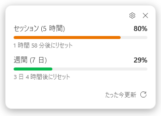
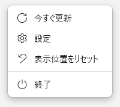
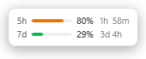
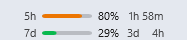
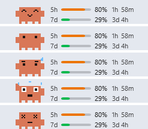
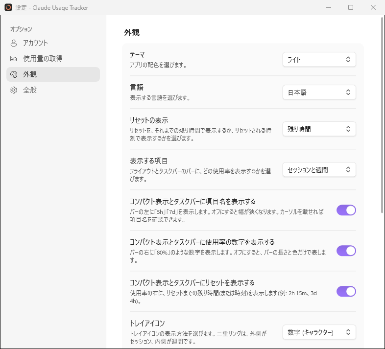
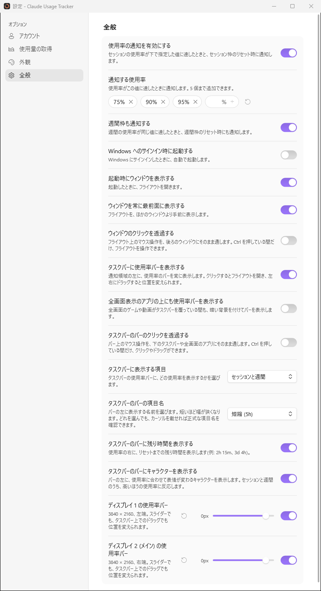

# Claude Usage Tracker for Windows

Claude Code の使用量 (5 時間のセッション枠・7 日間の週間枠) を、タスクトレイに常駐して表示する Windows アプリです。



- トレイアイコンのリングで、セッション枠の使用率と状態をひと目で確認
- クリックで開くフライアウトに、各枠の使用率とリセットまでの時間を表示
- フライアウトは大きさ・不透明度を変えられ、2 行だけのコンパクト表示や、クリックを後ろに通す設定も可能
- タスクバーの通知領域の左に、使用率のバーを常時表示 (モニターごとに設定可能)
- セッション枠・週間枠の使用率が指定した値 (既定は 75% / 90% / 95%) に達したときと、枠のリセット時に Windows 通知
- 既定では使用量を消費せずに取得 (5 分ごと)。細かく更新したい場合は 1 トークンのプロンプトで取得する方法も選択可能
- ライト / ダーク テーマ、日本語 / 英語表示に対応
- Windows 版に加え、WSL 内の Claude Code にも対応

## 動作要件

- Windows 10 バージョン 1809 以降、または Windows 11
- [Claude Code](https://docs.anthropic.com/en/docs/claude-code/overview) (Windows 側か WSL 側のどちらか)
- ビルドには [.NET 10 SDK](https://dotnet.microsoft.com/download)、実行には .NET 10 Desktop Runtime

## ビルドと起動

```powershell
# ビルドして起動
dotnet run --project src/ClaudeUsageTracker.App

# 配布用に発行 (publish/ClaudeUsageTracker.App.exe が生成されます)
dotnet publish src/ClaudeUsageTracker.App -c Release -r win-x64 --self-contained false -o publish
```

## 使い方

### トレイアイコン

リングはセッション枠の使用率を、色はその使用率の高さを表します。フライアウトやタスクバーのバーと同じ色分けです。


| 色 | 状態 | 使用率 |
|---|---|---|
| 緑 | 余裕あり | 70% 未満 |
| 橙 | 注意 | 70% 以上 |
| 赤 | 危険 | 90% 以上 |

設定の **トレイアイコン** で、表示方法を **リング** (既定) / **二重リング** (外側がセッション枠、内側が週間枠) / **数字** (セッション枠の使用率) / **数字 (キャラクター)** (オレンジ色のドット絵のキャラクターの上に数字。数字の色が状態を表し、白・黄・暗い赤の順に高くなります) から選べます。二重リングの内側の輪も、週間枠の使用率で同じように色分けします。

左クリックでフライアウトを開閉します。右クリックのメニューには次の項目があります。

| 項目 | 内容 |
|---|---|
| 今すぐ更新 | 使用量を取得し直します |
| 設定 | 設定画面を開きます |
| 表示位置をリセット | フライアウトを既定の位置に戻します |
| ウィンドウをコンパクト表示 | フライアウトのコンパクト表示を切り替えます |
| ウィンドウのクリックを透過 | フライアウトのクリック透過を切り替えます |
| タスクバーのバーのクリックを透過 | タスクバーのバーのクリック透過を切り替えます (バーを表示しているときのみ) |
| 終了 | アプリを終了します |

オンになっている切り替え項目には、チェックマークが付きます。



### フライアウト

- **セッション (5 時間)** / **週間 (7 日)**: 使用率とリセットまでの時間。設定の **リセットの表示** を **時刻** にすると、「23:57 にリセット」のようにリセットされる時刻で表示します
- **右下の「たった今更新」など**: 最終更新時刻 (マウスを乗せると正確な時刻)
- **⟳**: 今すぐ更新
- **⚙**: 設定を開く
- **✕**: フライアウトを閉じる (アプリは終了しません)

フライアウトはどこでもドラッグして移動でき、その位置は次回 (Windows の再起動後も) 覚えています。移動したことがなければ、Windows 11 のクイック設定と同じく、タスクバーのトレイ側の隅 (タスクバーが下なら右下) に開きます。モニターを外すなどで保存した位置が画面外になった場合は、いちばん近いモニターの画面内に表示します。サインインや通信に問題があるときは警告が表示され、必要に応じて **サインイン** ボタンも表示されます。

見た目と操作は次のように変えられます。

| 機能 | 内容 | 変え方 |
|---|---|---|
| 大きさ | 文字やバーも含めて全体を 50〜150% に拡大縮小します。100% 付近では 100% に吸着します | フライアウトの端や角をドラッグ、または設定の **ウィンドウの拡大率** |
| 不透明度 | 20〜100%。下げるほど後ろが透けて見えます | 設定の **ウィンドウの不透明度** |
| コンパクト表示 | 項目ごとに 1 行 (短い項目名・バー・使用率・残り時間) だけの小さな表示にします。ボタンは表示されません | フライアウトをダブルクリック、トレイメニュー、または設定 |
| クリックの透過 | フライアウト上のマウス操作を、後ろのウィンドウにそのまま通します。**Ctrl** を押している間だけ、フライアウトを操作できます | トレイメニュー、または設定 |



コンパクト表示やクリック透過の間は **✕** を押せないので、フライアウトはトレイアイコンの左クリックで閉じてください。

### タスクバーのバー

設定の **タスクバーに使用率バーを表示する** をオンにすると、タスクバーの通知領域の左に、使用率のバーを常に表示します (既定はオフ)。



- クリックでフライアウトを開閉し、左右にドラッグすると位置を変えられます
- カーソルを載せると、正式な項目名とリセットまでの時間を表示します
- 文字の色は、アプリのテーマではなく Windows のモード (タスクバーの明暗) に合わせます
- モニターが複数あるときは、各モニターのタスクバーに表示します。表示するかどうかと位置は、モニターごとに設定できます
- 残り時間は `45m` / `2h 15m` / `3d 4h` の形で表示します。設定の **リセットの表示** が **時刻** のときは、`23:57` / `金 2:08` のようにリセットされる時刻を表示します

設定の **タスクバーのバーにキャラクターを表示する** をオンにすると、バーの左に、使用率に合わせて表情が変わるドット絵のキャラクターを表示します (既定はオフ)。



| 使用率 (セッションと週間の高いほう) | 表情 |
|---|---|
| セッションが 10% 未満 (リセット直後) | きらきらの中で小さく跳ねる |
| 70% 未満 | 普通の顔で、ときどき瞬き |
| 70% 以上 | 目が泳ぎ、汗が流れる |
| 90% 以上 | 慌てて腕をばたつかせる |
| 100% | 目を閉じて眠り、z が浮かぶ |

どのくらい動くかは、設定の **キャラクターの動き** で選べます。

| 動き | 内容 |
|---|---|
| 動かさない | 表情は使用率に合わせて変わりますが、動きません |
| 控えめ (既定) | 表情が変わったときと、その後は 1 分ごとに数秒だけ動きます。普通の顔のときは瞬きだけです |
| よく動く | ずっと動き続けます。普通の顔のときも、周りを見たり跳ねたりします |

同じキャラクターは、設定の **ウィンドウにキャラクターを表示する** でフライアウトにも表示できます (左下の隅。コンパクト表示では行の左)。

次のときはバーを表示しません。

- タスクバーが縦置きのとき
- タスクバーが自動的に隠れている間
- 全画面表示のアプリがタスクバーを覆っている間 (**全画面表示のアプリの上にも使用率バーを表示する** をオンにすると、暗い背景を付けて表示します)

Windows 11 にはタスクバーに部品を埋め込む公式の仕組みがないため、タスクバーの上に小さなウィンドウを重ねて表示しています。そのため、タスクバーのアプリアイコンが通知領域の近くまで並ぶと、バーとアイコンが重なります。その場合は、項目名や残り時間を消して幅を狭くするか、位置をずらしてください。

### 設定



変更はその場で保存・反映されます。設定は左側の 4 つのページに分かれています。

**アカウント**

| 項目 | 内容 |
|---|---|
| Claude Code のアカウント | 表示中のアカウントを確認し、サインインや切り替えができます |
| 接続テスト | **確認** を押すと、実際に使用量を取得できるか確認できます |

**使用量の取得**

| 項目 | 内容 |
|---|---|
| 使用量を消費しない | オンのときは使用量を消費せずに取得し、更新は 5 分ごとになります。オフにすると 1 トークンのプロンプトで取得し、更新間隔を自由に設定できます (既定はオン) |
| 更新間隔 | **使用量を消費しない** をオフにしたときの更新間隔。10〜3600 秒 (既定 60 秒)。入力欄の下に、その間隔での 1 時間あたりの消費トークンの目安が表示されます。↑ / ↓ キーやマウスホイールでも 5 秒ずつ変更できます |

**外観**

| 項目 | 内容 |
|---|---|
| テーマ / 言語 | ドロップダウンで選びます。既定は Windows の設定に従います |
| リセットの表示 | リセットを、それまでの残り時間で表示するか、リセットされる時刻で表示するか (既定は残り時間)。フライアウトとタスクバーのバーの両方に効きます |
| 表示する項目 | セッションと週間 / セッションのみ / 週間のみ。フライアウト (通常・コンパクト) とタスクバーのバーに効きます |
| コンパクト表示とタスクバーに項目名を表示する | バーの左に `5h` / `7d` を表示します。オフにすると幅が狭くなります (既定はオン) |
| コンパクト表示とタスクバーに使用率の数字を表示する | バーの右に `80%` のような数字を表示します。オフにすると、バーの長さと色だけで表します (既定はオン) |
| コンパクト表示とタスクバーにリセットを表示する | 使用率の右に、リセットまでの残り時間 (または時刻) を表示します (既定はオン) |
| トレイアイコン | リング / 二重リング / 数字 / 数字 (キャラクター) (既定はリング) |
| ウィンドウの不透明度 | フライアウトの不透明度 (20〜100%、既定 100%) |
| ウィンドウの拡大率 | フライアウト全体の大きさ (50〜150%、既定 100%) |
| ウィンドウをコンパクト表示にする | フライアウトを項目ごとに 1 行の小さな表示にします (既定はオフ) |
| ウィンドウにキャラクターを表示する | フライアウトに、使用率に合わせて表情が変わるキャラクターを表示します (既定はオフ) |
| キャラクターの動き | フライアウトとタスクバーのキャラクターの動き: 動かさない / 控えめ / よく動く (既定は控えめ) |

**全般**

| 項目 | 内容 |
|---|---|
| 使用率の通知を有効にする | 使用率の通知とセッション枠のリセット通知 (既定はオン) |
| 通知する使用率 | 通知する使用率を 5 個まで指定します (既定は 75% / 90% / 95%)。数字を入れて **+** で追加し、**✕** で削除します。右端の ↺ で既定に戻せます |
| 週間枠も通知する | 週間枠の使用率が同じ値に達したときと、週間枠のリセット時にも通知します (既定はオン) |
| Windows へのサインイン時に起動する | Windows にサインインしたときに自動で起動します |
| 起動時にウィンドウを表示する | 起動したときにフライアウトを開きます (既定はオン) |
| ウィンドウを常に最前面に表示する | フライアウトをほかのウィンドウより手前に表示します (既定はオン) |
| ウィンドウのクリックを透過する | フライアウト上のマウス操作を後ろのウィンドウに通します (既定はオフ) |
| タスクバーに使用率バーを表示する | タスクバーのバーを表示します (既定はオフ)。以下の項目は、これがオンのときだけ変更できます |
| 全画面表示のアプリの上にも使用率バーを表示する | 全画面のゲームや動画がタスクバーを覆っている間も、バーを表示します (既定はオフ) |
| タスクバーのバーのクリックを透過する | バー上のマウス操作を、下のタスクバーや全画面のアプリに通します。**Ctrl** を押している間だけ、クリックやドラッグができます (既定はオフ) |
| タスクバーのバーにキャラクターを表示する | バーの左に、使用率に合わせて表情が変わるキャラクターを表示します (既定はオフ) |
| ディスプレイごとの使用率バー | モニターごとに、バーを表示するかどうかと、自動で決まる位置からのずれ (-3000〜300px) を設定します |



## サインイン

このアプリは独自のログイン機能を持たず、Claude Code のサインインをそのまま使います。

**サインイン** (フライアウトの警告、または設定のアカウント) を押すと `claude auth login` が起動し、ブラウザで claude.ai のサインイン画面が開きます。サインインが終わると、アプリが自動で検知して使用量を取得し直します。

- **アカウントを切り替え** は Claude Code 自体のアカウントも切り替えます
- ログアウト機能はありません (Claude Code 自体もログアウトしてしまうため)
- WSL 内の Claude Code だけを使っている場合は、WSL 内で `claude auth login` を実行してください

Claude Code をしばらく使わずにサインインの有効期限が切れると、「期限切れ」と表示されます。次に Claude Code を使えば自動で更新され、表示も戻ります。すぐに戻したいときは **サインイン** を押してください。

## 通知

**使用率の通知** がオンのとき、次のタイミングで通知します。

- セッション枠の使用率が、設定の **通知する使用率** で指定した値 (既定は 75% / 90% / 95%) に達したとき (それぞれ 1 回)
- セッション枠がリセットされたとき
- **週間枠も通知する** がオンのときは、週間枠についても同じ値に達したとき (それぞれ 1 回) と、リセットされたとき

## 仕組み

Claude Code の認証情報ファイルを読み取り (書き込みはしません)、Anthropic の API から使用量を取得します。

- Windows: `%USERPROFILE%\.claude\.credentials.json` (`CLAUDE_CONFIG_DIR` があればその下)
- WSL: 各ディストリビューションの `~/.claude/.credentials.json` (`wsl.exe` 経由。Windows 側が優先)

| 設定 | 取得方法 | 使用量の消費 | 更新間隔 |
|---|---|---|---|
| 使用量を消費しない (既定) | 使用量 API (`/api/oauth/usage`) から読み取る | なし | 5 分固定 |
| 使用量を消費しない をオフ | Messages API (Haiku 4.5) に `.` だけのプロンプトを送り (出力は 1 トークン)、レスポンスのレート制限ヘッダーから読み取る | 1 回約 10 トークン | 10〜3600 秒 |

1 トークンのプロンプトで取得する場合の消費量の目安は次のとおりです。Claude Code に 1 回指示を出すだけでも、通常は数千〜数万トークンを使います。

| 更新間隔 | 1 時間あたり | 8 時間あたり |
|---|---|---|
| 10 秒 | 約 3,600 トークン | 約 28,800 トークン |
| 60 秒 (既定) | 約 600 トークン | 約 4,800 トークン |
| 300 秒 | 約 120 トークン | 約 960 トークン |

トークン数が使用量の枠にどう換算されるかは公開されていないため、あくまで目安です。

Haiku 4.5 が廃止された場合は、使えるモデルの一覧 (取得に使用量は消費しません) から最も安いもの (新しい Haiku → Sonnet → Opus の順) に自動で切り替えます。使用中のモデルは設定画面の更新間隔の下に表示されます。

使用量 API は短い間隔で呼ぶと一時的に制限され (HTTP 429)、1 時間以上解けないこともあるため、5 分間隔に固定しています。制限されたときは次の 1 回を飛ばし、10 分後に再試行します (成功するまで 10 分間隔、成功すると 5 分間隔に戻ります)。⟳ や右クリックメニューからの手動更新も、前回の取得から 2 分以内は使用量 API を呼ばず、フライアウト下部に「あと ○ 分で更新できます」と表示します。制限中は最後に取得した値を表示し続けます。

## 設定ファイル

設定は `%APPDATA%\ClaudeUsageTracker\settings.json` に保存されます (自動起動のみレジストリの `HKCU\Software\Microsoft\Windows\CurrentVersion\Run`)。

| キー | 内容 | 既定値 |
|---|---|---|
| `RefreshIntervalSeconds` | 更新間隔 (秒、10〜3600) | `60` |
| `AvoidTokenUsage` | 使用量を消費しない | `true` |
| `NotificationsEnabled` | 使用率の通知 | `true` |
| `NotificationThresholds` | 通知するセッション使用率 (1〜100、5 個まで) | `[75, 90, 95]` |
| `WeeklyNotificationsEnabled` | 週間枠も通知する | `true` |
| `ResetTimeDisplay` | リセットの表示: `Remaining` (残り時間) / `Clock` (時刻) | `Remaining` |
| `TrayIconStyle` | トレイアイコン: `Ring` / `DoubleRing` / `Number` / `NumberOnCreature` | `Ring` |
| `ShowFlyoutOnStartup` | 起動時にフライアウトを表示 | `true` |
| `AlwaysOnTop` | フライアウトを常に最前面に表示 | `true` |
| `Theme` | `System` / `Light` / `Dark` | `System` |
| `Language` | `System` / `English` / `Japanese` | `System` |
| `FlyoutOpacityPercent` | フライアウトの不透明度 (%、20〜100) | `100` |
| `FlyoutScale` | フライアウトの拡大率 (0.5〜1.5) | `1` |
| `VisibleRows` | 表示する項目: `Both` / `SessionOnly` / `WeeklyOnly` | `Both` |
| `CompactShowLabels` | コンパクト表示とタスクバーに項目名を表示 | `true` |
| `CompactShowPercentage` | コンパクト表示とタスクバーに使用率の数字を表示 | `true` |
| `CompactShowResetTime` | コンパクト表示とタスクバーにリセットを表示 | `true` |
| `FlyoutCompact` | フライアウトのコンパクト表示 | `false` |
| `FlyoutClickThrough` | フライアウトのクリック透過 | `false` |
| `FlyoutShowMascot` | フライアウトにキャラクターを表示 | `false` |
| `MascotAnimation` | キャラクターの動き (フライアウトとタスクバーの両方): `Off` / `Subtle` / `Lively` | `Subtle` |
| `FlyoutPosition` | ドラッグで移動したフライアウトの位置 (画面のピクセル座標)。トレイメニューの **表示位置をリセット** で消去されます | なし |
| `ShowTaskbarBar` | タスクバーのバーを表示 | `false` |
| `ShowTaskbarBarOverFullScreen` | 全画面表示のアプリの上にもバーを表示 | `false` |
| `TaskbarBarClickThrough` | タスクバーのバーのクリック透過 | `false` |
| `TaskbarBarShowMascot` | バーにキャラクターを表示 | `false` |
| `TaskbarBarDisplays` | モニターごとのバーの設定。キーはモニターのデバイス名 (JSON での表記例: `\\\\.\\DISPLAY2`)、値は `Show` (表示するか) と `Offset` (位置のずれ、-3000〜300) | なし (全モニターに、ずれなしで表示) |

## 開発

```
src/
  ClaudeUsageTracker.App/        WPF アプリ本体 (画面、ViewModel、テーマ、翻訳、トレイ)
  ClaudeUsageTracker.Core/       Windows に依存しないロジック (API クライアント、状態判定)
  ClaudeUsageTracker.Platform/   Windows 固有の処理 (CLI / WSL 呼び出し、通知、自動起動、アイコン描画)
tests/
  ClaudeUsageTracker.Tests/      ユニットテスト (xUnit)
```

- 依存の向きは App → Platform → Core の一方向です。Core は `net10.0` を対象にしており、Windows 固有の API は使えません
- 画面の文字列は `src/ClaudeUsageTracker.App/Localization/` の `Strings.resx` (英語) と `Strings.ja.resx` (日本語) にあります。両方を編集してください
- テストは `dotnet test` で実行します
