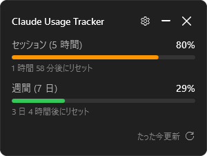
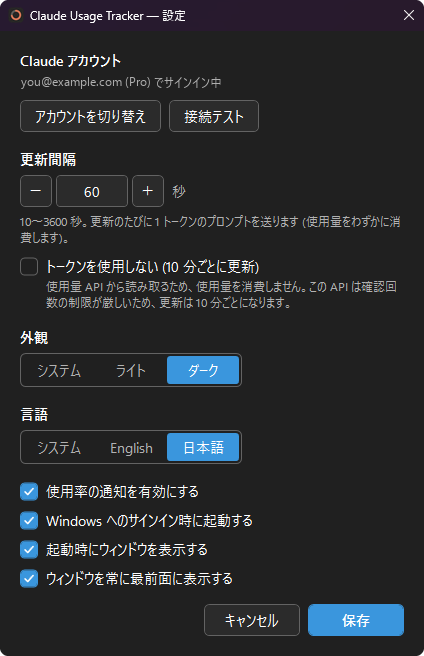

# Claude Usage Tracker for Windows

Claude Code の使用量 (5 時間のセッション枠・7 日間の週間枠) を、Windows のタスクトレイに常駐して表示するアプリです。

<p>
  
  &nbsp;
  
</p>

- トレイアイコンのリングで、セッション枠の使用率と状態 (緑・橙・赤) をひと目で確認できる
- クリックで開くフライアウトに、セッション・週間それぞれの使用率とリセットまでの時間を表示
- 使用率が 75% / 90% / 95% に達したときと、セッション枠がリセットされたときに Windows 通知
- ライト / ダーク / システム設定に追従のテーマ切り替え
- 日本語と英語の表示に対応 (既定は Windows の表示言語に追従)
- Windows 版 Claude Code に加え、WSL 内の Claude Code の認証情報にも対応
- 使用量の取得方法を選べる: 既定は 1 トークンのプロンプトで取得 (更新間隔は 10 秒から設定可能)。**トークンを使用しない** 設定にすると使用量を消費しない方法で取得 (10 分ごとに更新)

## 動作要件

- Windows 10 バージョン 1809 以降、または Windows 11
- [Claude Code](https://docs.anthropic.com/en/docs/claude-code/overview) がインストールされていること (Windows 側か WSL 側のどちらか)
  - ネイティブ版 (単体の `claude.exe`) なら Node.js は不要です。npm 版でも動作します
  - サインインはアプリからもできます ([サインイン](#サインイン) を参照)
- ビルドには [.NET 10 SDK](https://dotnet.microsoft.com/download) が必要

## ビルドと起動

```powershell
# ビルドして起動
dotnet run --project src/ClaudeUsageTracker.App

# 配布用に発行 (実行には .NET 10 Desktop Runtime が必要)
dotnet publish src/ClaudeUsageTracker.App -c Release -r win-x64 --self-contained false -o publish
```

`publish/ClaudeUsageTracker.App.exe` を実行すると起動します。

## 使い方

画面は日本語表示のものです。設定の **言語** で English を選ぶと英語表示になります。

### 1. 起動する

起動するとタスクトレイにアイコンが表示されます。初期設定では、起動時にフライアウトも開きます。

アイコンのリングはセッション枠 (5 時間) の使用率を表し、色で状態を示します。


| 色 | 状態 | 目安 |
|---|---|---|
| 緑 | 余裕あり | このペースなら枠の 70% 未満で収まりそう |
| 橙 | 注意 | このペースだと枠の 70% 以上を使いそう |
| 赤 | 危険 | このペースだと枠の 90% 以上を使いそう |

色は、単純な使用率ではなく消費ペースで判定します。セッション枠の経過時間が 15% 以上のときは「今の使用率 ÷ 経過した割合」で枠の終わりの使用率を予測し、予測が 70% 以上なら橙、90% 以上なら赤になります。それ以外 (枠の開始直後など) は、使用率そのもので判定します (70% 未満は緑、90% 未満は橙、それ以上は赤)。

### 2. フライアウトで使用量を見る

トレイアイコンを左クリックすると、フライアウトが開きます。


- **セッション (5 時間)**: 5 時間のセッション枠の使用率と、リセットまでの時間
- **週間 (7 日)**: 7 日間の週間枠の使用率と、リセットまでの時間
- **右下の「たった今更新」など**: 最後に更新した時刻。マウスを乗せると正確な時刻を表示します
- **⟳**: 今すぐ更新
- **⚙**: 設定画面を開く
- **— / ✕**: フライアウトを閉じる (どちらもトレイに戻るだけで、アプリは終了しません)

ヘッダー部分をドラッグすると、フライアウトを移動できます。サインインや通信に問題があるときは、使用率の上に警告が表示されます。サインインが必要な場合は、警告の中に **サインイン** ボタンが表示されます。

### 3. トレイアイコンの右クリックメニュー

| 項目 | 動作 |
|---|---|
| 更新 | 今すぐ更新 |
| 終了 | アプリを終了 |

### 4. 設定を変える

フライアウトの ⚙ から設定画面を開きます。

sequenceDiagram
actor Alice
actor John
Alice->>John: Hello John, how are you?
John-->>Alice: Great!
Alice-)John: See you later!
sequenceDiagram
actor Alice
actor John
Alice->>John: Hello John, how are you?
John-->>Alice: Great!
Alice-)John: See you later!
<p>
  
  &nbsp;
  
</p>

| 項目 | 内容 |
|---|---|
| Claude アカウント | 使用量を表示しているアカウント (メールアドレスとプラン) を表示します。**サインイン** / **アカウントを切り替え** でサインインやアカウントの切り替えができます ([サインイン](#サインイン) を参照)。**接続テスト** では、定期更新と同じ方法で実際に使用量を取得できるか確認し、結果はフライアウトにも反映されます (**トークンを使用しない** がオフなら、1 トークンのプロンプトを送ります) |
| 更新間隔 | 自動更新の間隔 (既定は 60 秒、10〜3600 秒)。更新のたびに 1 トークンのプロンプトを送ります。数字のみ入力でき、− / ＋ボタン、↑ / ↓ キー、マウスホイールで 5 秒ずつ増減します。**トークンを使用しない** をオンにしている間は、10 分固定になり変更できません |
| トークンを使用しない (10 分ごとに更新) | オンにすると、使用量を消費しない使用量 API から取得します (既定はオフ)。この API は確認回数の制限が厳しいため、更新は 10 分ごとになります ([使用量の取得方法](#使用量の取得方法) を参照) |
| 外観 | システム (Windows の設定に追従) / ライト / ダーク。選ぶとすぐプレビューされ、キャンセルで元に戻ります |
| 言語 | システム (Windows の表示言語が日本語なら日本語、それ以外は英語) / English / 日本語。選ぶとすぐ切り替わり、キャンセルで元に戻ります |
| 使用率の通知を有効にする | 使用率の通知を出すかどうか |
| Windows へのサインイン時に起動する | Windows へのサインイン時に自動起動するかどうか |
| 起動時にウィンドウを表示する | 起動時にフライアウトを開くかどうか |
| ウィンドウを常に最前面に表示する | フライアウトをほかのウィンドウより常に手前に表示するかどうか (既定はオン)。オフにすると、ほかのウィンドウを操作したときにその後ろに隠れます |

**保存** を押すと、すぐに反映されます。

## サインイン

このアプリは独自のログイン機能を持たず、Claude Code CLI のサインインをそのまま利用します。

1. 未サインインまたはサインインの期限切れのとき、フライアウトの警告に **サインイン** ボタンが表示されます。設定画面の **Claude アカウント** からも、**サインイン** (サインイン済みなら **アカウントを切り替え**) を押せます。
2. ボタンを押すと、コンソールウィンドウで `claude auth login` が起動し、ブラウザで claude.ai のサインイン画面が開きます。Google アカウントなど、普段の方法でサインインしてください。
3. サインインが終わると Claude Code の認証情報ファイルが更新され、アプリが自動で検知して使用量を取得し直します。

- **アカウントを切り替え** で別のアカウントにサインインすると、**Claude Code 自体のアカウントも切り替わります**。
- ログアウト機能はありません。アプリからログアウトすると Claude Code 自体もログアウトしてしまうためです。表示を止めたいときはアプリを終了してください。
- WSL 内の Claude Code だけを使っている場合は、アプリからはサインインを起動できません。WSL 内で `claude auth login` を実行してください。

### サインインの有効期限について

Claude Code のサインイン (アクセストークン) には有効期限があり、Claude Code を使うたびに自動で更新されます。しばらく Claude Code を使わずに期限が切れると、このアプリには「期限切れ」と表示されます。次に Claude Code を使えば自動で更新され、アプリもそれを検知して表示が戻ります。すぐに戻したい場合は **サインイン** を押してください。

このアプリがトークンを自分で更新しないのは、使用量を消費せずに Claude Code CLI へトークンを更新させる方法が見つかっていないためです (`claude auth status` や `claude doctor` では更新されないことを確認しています。プロンプトを実行すれば更新されますが、使用量を消費します)。

## 通知

**使用率の通知を有効にする** がオンのとき、次のタイミングで Windows の通知を出します。

- セッション枠の使用率が **75% / 90% / 95%** に達したとき (それぞれ 1 回だけ)
- セッション枠がリセットされたとき (使用率が 5% 超から 5% 未満に下がったとき)。リセット後は、各しきい値の通知がまた出るようになります

## 仕組み

1. **認証情報を探す**: Claude Code CLI 自身の認証情報ファイルを読み取ります (書き込みはしません)。
   - Windows: `%USERPROFILE%\.claude\.credentials.json` (環境変数 `CLAUDE_CONFIG_DIR` があればその下)
   - WSL: インストール済みの各ディストリビューションの `~/.claude/.credentials.json` を `wsl.exe` 経由で読み取り
   - Windows 側を優先し、見つからなければ WSL のディストリビューションを順に探します
2. **使用量を取得する**: 設定に応じて、次のどちらかの方法で取得します ([使用量の取得方法](#使用量の取得方法) を参照)。
3. **アカウントを確認する**: 設定画面のアカウント表示には `claude auth status --json` を使います。ローカルの状態を読むだけのコマンドで、こちらも使用量は消費しません。

このアプリがトークンを書き換えたり、OAuth の処理を自分で行ったりすることはありません。

### 使用量の取得方法

| 設定 | 取得方法 | 使用量の消費 | 更新間隔 |
|---|---|---|---|
| 既定 | Messages API に 1 トークンのプロンプトを送り、レスポンスのレート制限ヘッダーから使用量を読み取ります | 更新のたびにわずかに消費 | 10〜3600 秒で設定可能 (既定 60 秒) |
| **トークンを使用しない** をオン | 使用量 API (`https://api.anthropic.com/api/oauth/usage`) から取得します。使用量を返すだけで、プロンプトは実行しません | なし | 10 分固定 |

使用量 API は、短い間隔で呼び続けると一時的に制限されます (HTTP 429)。制限がどのくらいで解けるかは公開されておらず、1 時間以上続くこともあります。**トークンを使用しない** 設定の更新間隔を 10 分に固定しているのはこのためです。制限されたときは、最後に取得した値を表示したまま、次の更新 (10 分後) で再試行します。

## 設定ファイル

設定は `%APPDATA%\ClaudeUsageTracker\settings.json` に保存されます。

| キー | 内容 | 既定値 |
|---|---|---|
| `RefreshIntervalSeconds` | 自動更新の間隔 (秒)。10〜3600 の範囲に丸められます。`AvoidTokenUsage` がオンの間は使われません (10 分固定) | `60` |
| `NotificationsEnabled` | 使用率の通知 | `true` |
| `ShowFlyoutOnStartup` | 起動時にフライアウトを開く | `true` |
| `AlwaysOnTop` | フライアウトを常に最前面に表示する | `true` |
| `Theme` | `System` / `Light` / `Dark` | `System` |
| `Language` | `System` / `English` / `Japanese` | `System` |
| `AvoidTokenUsage` | トークンを使用しない (使用量 API から 10 分ごとに取得) | `false` |
| `NotifiedThresholdKeys` | 通知済みのしきい値 (同じ通知の重複防止用。通常は編集不要) | `[]` |

自動起動の設定だけは、このファイルではなくレジストリ (`HKCU\Software\Microsoft\Windows\CurrentVersion\Run`) に保存されます。

## プロジェクト構成

```
src/
  ClaudeUsageTracker.App/        WPF アプリ本体 (画面、ViewModel、テーマ、翻訳、トレイ、全体の組み立て)
  ClaudeUsageTracker.Core/       Windows に依存しないロジック (API クライアント、レスポンス解析、状態判定)
  ClaudeUsageTracker.Platform/   Windows 固有の処理 (Claude CLI / WSL の呼び出し、通知、自動起動、アイコン描画)
tests/
  ClaudeUsageTracker.Tests/      Core のユニットテスト (xUnit)
```

依存の向きは App → Platform → Core の一方向です。Core は `net10.0` を対象にしているため、Windows 固有の API が混入するとビルドエラーになります。

画面の文字列は `src/ClaudeUsageTracker.App/Localization/` の `Strings.resx` (英語) と `Strings.ja.resx` (日本語) にあります。文言を変えるときは両方を編集してください。

## テスト

```powershell
dotnet test
```
